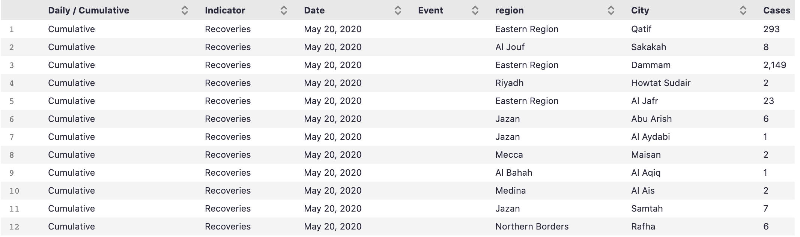
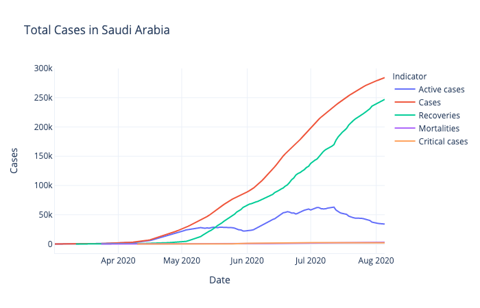

# Communicate-Data-Findings-DAND-Udacity

This project is divided into two major parts.

1. In the first part, you will conduct an exploratory data analysis on a dataset of your choosing. You will use Python data science and data visualization libraries to explore the dataset’s variables and understand the data’s structure, oddities, patterns and relationships. The analysis in this part should be structured, going from simple univariate relationships up through multivariate relationships, but it does not need to be clean or perfect. There is no one single answer that needs to come out of a given dataset. This part of the project is your opportunity to ask questions of the data and make your own discoveries. It’s important to keep in mind that sometimes exploration can lead to dead ends, and that it can take multiple steps to dig down to what you’re truly looking for. Be patient with your steps, document your work carefully, and be thorough in the perspective that you choose to take with your dataset.

2. In the second part, you will take your main findings from your exploration and convey them to others through an explanatory analysis. To this end, you will create a slide deck that leverages polished, explanatory visualizations to communicate your results. This part of the project should make heavy use of the first part of the project. Select one or two major paths in your exploration, choose relevant visualizations along that path, and then polish them to construct a story for your readers to understand what you found.

## Choose your Dataset
The dataset I've chosen is about Saudi Arabia's Covid-19 situation and can be found in the [KAPSARC Website](https://datasource.kapsarc.org/explore/dataset/saudi-arabia-coronavirus-disease-covid-19-situation/export/?sort=-daily_accumulative&disjunctive.daily_cumulative&disjunctive.daily_accumulative=&dataChart=%3D&disjunctive.indicator&disjunctive.event&disjunctive.city&disjunctive.region). The data consisted of approximately 77,987 rows. The attributes included the Daily/Cumulative, Indicator, Date, Event, Region,City and most importantly number of Cases. Six data points were removed from the analysis due to missing information.

## Explore Your Data
In this investigation, I wanted to look at how the Covid-19 situation has affected Saudi Arabia.I want to know which regions or cities have been affected the most, in addition to if any events helped in reducing the spread like for example starting or lifting curfews in certain regions or country wide.

You can view the data exploration files here:
- [exploration_template.ipynb](exploration_template.ipynb)
- [exploration_template.html](exploration_template.html)

## Document your Story

- There's 13 Saudi regions, in addition to the Total column which makes 14 values. The 3 regions with the highest number of values in the dataset are Riyadh, Eastern Region and Mecca. 
- There's 5 indicators, Starting with Cases, Recoveries, Active cases, Mortalities and lastly Critical cases, the value counts of the indicators are in this order.This seems to be a good indication of Recovery rate being high, and Critical cases being relatively low in the country.
- Regarding the cities in the Mecca region, as of the 5th of August, Jeddah has the most Active cases of Covid-19, with 3675 cases. Mecca is second and has 1584 cases, Taif has 872. Hadda with the least active cases only has 1 case.
- The cumulative number of cases of Covid-19 up until the latest date in the dataset, which is the 5th of August, the regions in the top 3 spots are Mecca, Eastern Region and Riyadh, although their order differs. Mecca and Eastern Region alone take up half the pie graph, meaning that half the cases in the country up until the 5th of August are in those 2 regions.
- The total number of cases for each indicator, from the start of the first case of Covid-19 in the 2nd of March 2020, up until the latest date in the dataset which is the 5th of August. Recovery rates have been higher than the active cases since the 17th of May 2020. We can also see that Mortalities and Critical cases have been relatively low. 
- In the dataset, there was an Event column indicating if any event happened like for example the start or end of curfew for some regions or cities. I plotted this with the number of daily cases to see if any event had an impact in the number of daily cases. I noticed a spike in cases after the partial lifting of curfew in all cities except Makkah and after curfew lifted in all regions. The cases have been gradually decreasing since the 7th of July.
- I used a bubble chart for July 2020's cases of Covid-19. The highest recovery count for one day was on the 13th of July 2020 with 7718 recoveries made in one day.

## Create your Slide Deck
I created my slide deck using the command `jupyter nbconvert slide_deck_template.ipynb --to slides --template output-toggle.tpl
--post serve` .

It can be viewed in the [slide_deck_template.slides.html](slide_deck_template.slides.html) file.

## Review and Submit the Project
I checked my project against the project rubrics to make sure I passed all the criteria.
